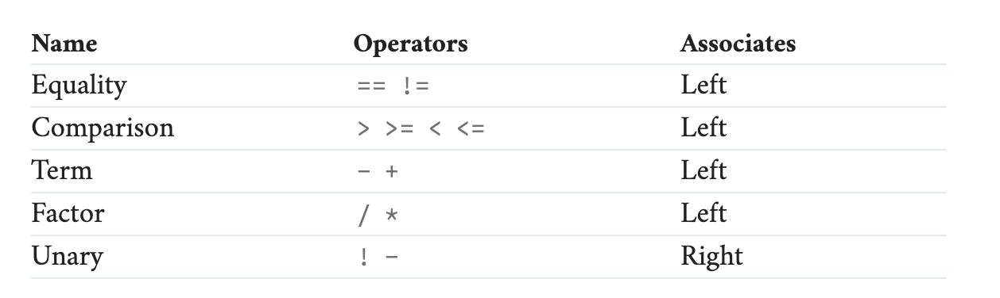
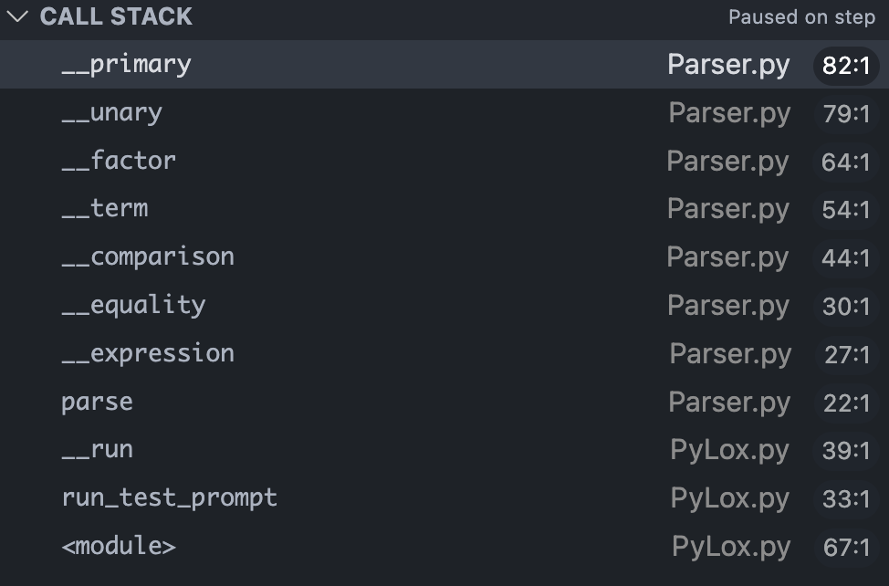

# Chapter 6 Parser

## Parser 实现

这一节真正开始生成 AST - 抽象语法树，树的构建是通过递归下降来实现的。
上一节已经定义了四条语法规则，分别支持二元操作符，括号合并，字面量，一元操作符。

对于一条语句来说，除了语法规则，还有一个问题需要解决，**歧义性**。

对于语句 `1 * 3 - 2` 在语法规则下可以有 `(1*3)-2` 和 `1*(3-2)` 两种解读方式，这种歧义性可以通过**优先级**来解决，也就是定义语法的 优先级顺序，然后就能确定是先计算乘法。

对于语句 `1 + 3 - 2` 在语法规则下可以有 `(1+3)-2` 和 `1+(3-2)` 两种解读方式，这种歧义性可以通过**解释顺序**来避免，比如我们规定某一条规则是从左往右解析的，那么就只支持第一种而不是第二种。

所以通过定义优先级和解释顺序，就可以避免语句的歧义性。

先仅仅考虑数学运算和比较符号，可以定义一个每种运算的优先级和解释顺序：



根据这个优先级和解释顺序来实现所有的语法规则，这里**通过递归的方法调用来实现规则的优先级**，是一个比较困难的点，是对抽象思维和代码逻辑的考验。

当我们定义时，我们采用优先级从低到高的顺序定义，在每一个方法中首先调用高优先级的语法方法，得到如下所式的调用栈：



这样就能看出真正的优先级顺序。

## 错误处理

对于一个 Parser 来说，遵循了语法的语句是有效输入，不遵循语法的输入也应该是有效输入。Parser 要做的是：
1. 对语法正确的语句进行解析
2. 对语法错误的语句进行错误提示

这里错误提示最好能做到两点：
1. 找到出现的错误，并且不提示因为这个错误产生的级联错误
2. 找到一个错误之后并不退出，而是跳过当前出错的部分，把剩下文件的错误全部都找出来

在第二点中，需要将 Parser 的状态进行重置，恢复到一个没有出过错的状态去重新解析，这个过程被称为同步（synchronization）。同步的方法就是抛弃出错行的所有 token，然后切换到下一行开始解析。

## 难点

在写这一章 Parser 的过程中，最难的地方就是**规则的理解**，如果没有很好的理解规则，就不可能将规则抽象成一个一个的类方法，并且通过递归调用去实现运算优先级和解释顺序。这里没有要求我来定义规则，而是仅仅实现作者定义好的规则，这已经有点困难了，要理解这种规则表现形式的通过很多例子来体会这个递归的过程。我也是通过debug跟踪了一个语句的解析过程才大概理解整个方法的调用顺序。

记录一下，这也是第一次写出一个可运行的 parser：
```Python
>>> Lox().run_test_prompt("1*4+(5-4)/2+2")

// output
// (+ (+ (* 1.0 4.0) (/ (group (- 5.0 4.0)) 2.0)) 2.0)
```